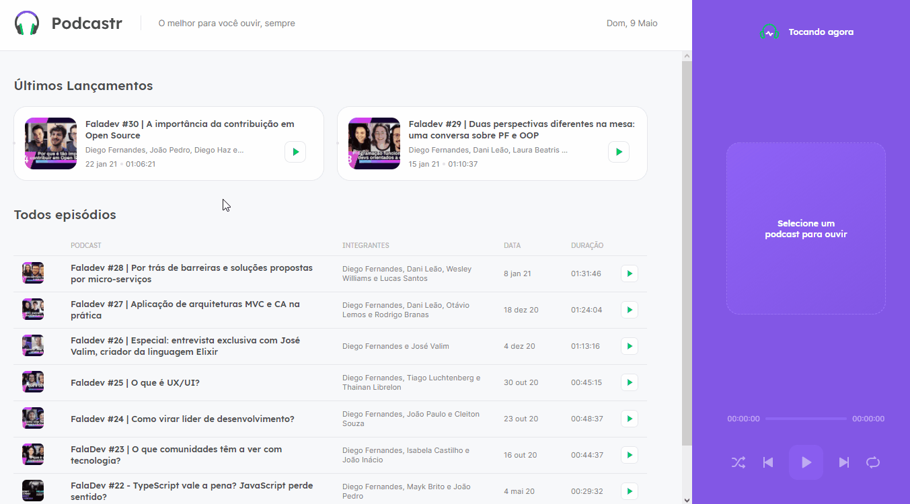

<h1 align="center">
  
</h1>

<p align="center">
  
</p>

<div align="center">
  
</div>

---

## 💡 Sobre o Projeto

Este projeto foi desenvolvido no evento Next Level Week 5 pela [Rocketseat](https://rocketseat.com.br/) 🚀&nbsp;💜

O Podcastr é um projeto para reproduzir episódios de podcast

---

## 🚀 Tecnologias e ferramentas utilizadas

- **HTML5**
- **SCSS**
- **TypeScript**
- **NEXT**
- **Node**
- **React**

---

## 🔧 Instruções para visualizar o projeto

### Requerimentos

- [Node.js](https://nodejs.org/en/download/)

```bash
    # Clone o repositório
    git clone https://github.com/willnogueyra/Podcastr

    cd Podcastr
```

```bash
    #instale as dependências se for necessárias com:
    npm i ou yarn

    #agora start o projeto
    npm start ou yarn start
```

```bash
    #Com um outro terminal aberto, starta o server no mesmo diretorio
    npm server ou yarn server
```

---

Feito por 💜&nbsp; William Nogueira 👋 &nbsp;[linkedin](https://www.linkedin.com/in/william-nogueira-870a98190/)
